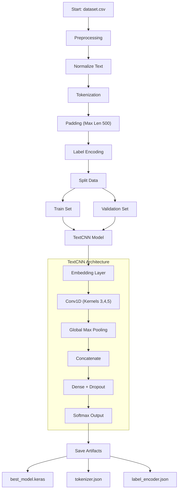
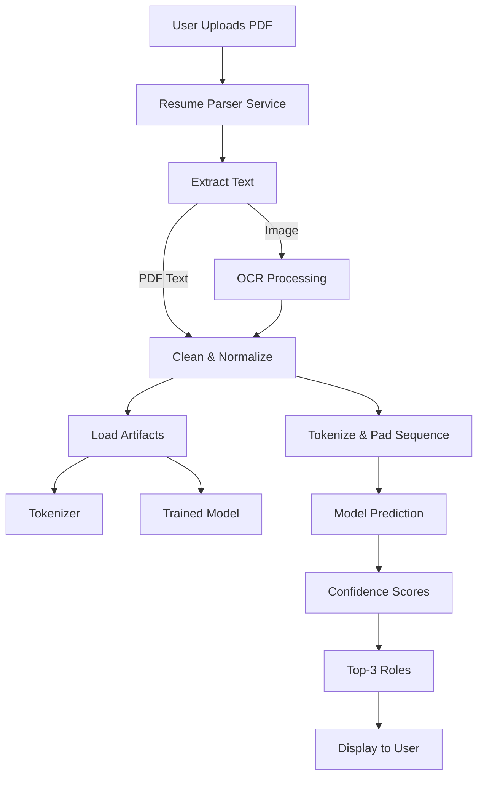

# Project Report: AI Resume Analyzer & ATS

## 1. Executive Summary

This project is a comprehensive **Applicant Tracking System (ATS)** and **Resume Analyzer** designed to automate the screening process for recruiters. It leverages **Natural Language Processing (NLP)** and **Deep Learning** to extract information from resumes, predict job roles, and calculate compatibility scores against job descriptions.

## 2. Visual Workflows

### 2.1. Model Training Workflow

This diagram explains how the model learns from the dataset (`train_model.py`).



### 2.2. Inference (Prediction) Workflow

This diagram explains how the system processes a new resume to predict its role.



````

## 3. Data Flow Diagrams (DFD)

### 3.1. Level 0 DFD (Context Diagram)

High-level interaction between the User and the System.

```mermaid
graph TD
    User["User/Recruiter"] -- "Uploads Resume" --> System["Resume Analyzer System"]
    User -- "Provides Job Description" --> System
    System -- "Returns Analysis/Score" --> User
    System -- "Returns Job Role Prediction" --> User
````

### 3.2. Level 1 DFD (Detailed Data Flow)

Detailed flow of data through internal processes.

```mermaid
graph TD
    User["User"] -- "Uploads File" --> Frontend["Frontend UI"]
    Frontend -- "Sends File" --> API["Backend API (FastAPI)"]

    API -- "Raw File" --> Parser["Resume Parser Service"]

    subgraph "Data Processing"
        Parser -- "Extracts Text" --> TextProc["Text Preprocessor"]
        TextProc -- "Clean Text" --> Model["AI Model (TextCNN)"]
        TextProc -- "Keyword Data" --> ATS["ATS Engine"]
    end

    Model -- "Returns Role" --> API
    ATS -- "Returns Score" --> API

    API -- "JSON Response" --> Frontend
    Frontend -- "Visual Reports" --> User
```

## 4. Machine Learning Model Report

The core intelligence of the system is the **Job Role Classifier**, which predicts the most suitable job role for a candidate based on their resume content.

### 3.1. Model Architecture

We implemented a **TextCNN (Convolutional Neural Network for Text)** architecture, which is highly effective for sentence classification tasks.

- **Embedding Layer**: Maps words to dense vectors of size **200**. Vocabulary size is capped at **25,000** words.
- **Convolutional Layers**: Three parallel 1D Convolutional layers with kernel sizes of **3, 4, and 5** (simulating n-grams). Each layer has **128 filters**.
- **Global Max Pooling**: Extracts the most important features from each convolution map.
- **Concatenation**: Combines features from all three kernel sizes.
- **Regularization**: Dropout layers (0.5 and 0.2) are used to prevent overfitting.
- **Fully Connected Layers**: A dense layer with **128 units** followed by a **Softmax** output layer for multi-class classification.

> **Why TextCNN?** TextCNN captures local patterns (like phrases "Project Manager", "Python Developer") effectively regardless of their position in the text, making it robust for resume analysis.

### 3.2. Training Pipeline

The training process is automated via the `scripts/train_model.py` script.

#### **Data Preparation**

1.  **Source**: The model is trained on `data/dataset.csv`.
2.  **Preprocessing**:
    - **Normalization**: Removal of special characters, newlines, and extra spaces.
    - **Tokenization**: Texts are converted to sequences of integers using a trained `Tokenizer`.
    - **Padding**: Sequences are padded/truncated to a fixed length of **500 tokens**.
    - **Label Encoding**: Target job roles are encoded into integers using `LabelEncoder`.

#### **Training Details**

- **Optimizer**: Adam (learning rate = 0.001).
- **Loss Function**: Sparse Categorical Crossentropy.
- **Class Balancing**: `compute_class_weight` is used to handle class imbalance in the dataset, ensuring rare job roles are not ignored.
- **Batch Size**: 64.
- **Epochs**: 12 (with Early Stopping).
- **Callbacks**:
  - `EarlyStopping`: Stops training if validation loss doesn't improve for 3 epochs.
  - `ReduceLROnPlateau`: Reduces learning rate if loss plateaus.
  - `ModelCheckpoint`: Saves only the best model.

### 3.3. Results & Evaluation

The model provides a **Confidence Score** for each prediction and can return the **Top-K** most likely roles.

- **Metrics**: Accuracy, Precision, Recall, and F1-Score are tracked.
- **Confusion Matrix**: Generated to visualize misclassifications.
- **Artifacts**:
  - `models/best_model.keras`: The saved trained model.
  - `models/tokenizer.json`: The tokenizer vocabulary.
  - `models/label_encoder.json`: The mapping of job roles.

## 5. System Architecture

The project follows a modern microservices-like architecture.

### 4.1. Backend (`resume_analyzer/backend`)

Built with **FastAPI** and **Python**.

- **Resume Parsing Service**: Uses `Spacy` (NER) and Regex to extract:
  - Contact Info (Email, Phone)
  - Names (Heuristic + NER)
  - Sections (Skills, Education, Experience)
- **OCR Integration**: Capable of reading image-based PDFs.
- **ATS Engine**: Calculates keyword overlap and semantic similarity between Resume and Job Description.

### 4.2. Frontend (`resume_analyzer/frontend`)

Built with **Next.js 16** and **React**.

- **UI/UX**: Modern, responsive interface using TailwindCSS.
- **Real-time Interaction**: Uploads are processed asynchronously, displaying results via dynamic components like `ResultsCard` and `SkillsChart`.

## 6. How to Reproduce Training

To retrain the model with new data:

1.  Place your new dataset in `resume_analyzer/backend/data/dataset.csv`.
2.  Navigate to the backend directory:
    ```bash
    cd resume_analyzer/backend
    ```
3.  Run the training script:
    ```bash
    python -m scripts.train_model
    ```
4.  The new model and artifacts will be saved to the `models/` directory automatically.

---
