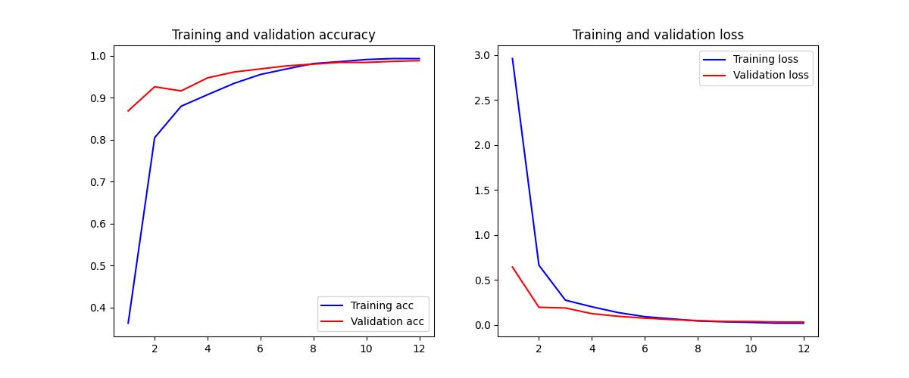

# Resume Analyzer Backend

This project is a powerful backend system for an Applicant Tracking System (ATS) and Resume Analyzer. It leverages advanced Natural Language Processing (NLP), Deep Learning, and OCR technologies to parse resumes, score them against job descriptions, and predict candidate job roles.

## 🚀 Key Features

- **Resume Parsing**: Automatically extracts structured data (Name, Email, Phone, Skills, Sections) from resumes.
- **Text Extraction**: Robust extraction from PDF and Image-based resumes (OCR support).
- **ATS Scoring**: Intelligent match scoring between a Resume and Job Description (JD).
- **Job Role Prediction**: Uses a Deep Learning model to classify resumes into specific job roles.
- **FastAPI Interface**: high-performance, asynchronous API for easy integration.

## 🛠️ Technical Stack & Algorithms

### 1. Text Extraction Layer

- **Libraries**: `pypdf`, `EasyOCR`, `OpenCV`, `NumPy`.
- **Logic**:
  - The system first attempts to extract text using `pypdf` for native PDFs.
  - If the file is an image or a scanned PDF (sparse text), it falls back to **EasyOCR** (GPU-accelerated) to perform Optical Character Recognition.
  - It handles multiple formats: `.pdf`, `.png`, `.jpg`, `.jpeg`, `.tiff`, `.bmp`.

### 2. Resume Parsing (Information Extraction)

- **Libraries**: `spaCy` (`en_core_web_sm`), `RegEx`.
- **Algorithms**:
  - **Named Entity Recognition (NER)**: Uses spaCy's pre-trained models to identify candidate names (PERSON entities), refined with custom heuristics to filter false positives (e.g., "Python" is not a person).
  - **Regular Expressions**: extensive regex patterns are used to reliably extract Emails and Phone Numbers.
  - **Section Segmentation**: A heuristic-based segmenter identifies standard resume sections (e.g., "Education", "Experience", "Skills") using fuzzy header matching.
  - **Skill Extraction**: Matches text against a predefined taxonomy of 40+ technical skills (e.g., Python, React, AWS) using word-boundary aware search.

### 3. Smart ATS Scoring Engine

The scoring engine combines **keyword matching** with **semantic similarity** to generate a holistic match score (0-100%).

- **Algorithm**: `Weighted Keyword Match` + `Cosine Similarity`.
- **Process**:
  1.  **Preprocessing**: Text is cleaned (lowercased, special chars removed) and tokenized.
  2.  **Weighted Keyword Matching (60% of Score)**:
      - Extracts unigrams and bigrams from the Job Description.
      - Searches for these keywords in the Resume.
      - **Fuzzy Matching**: Uses `difflib.SequenceMatcher` (cutoff 0.8) to catch typos or variations.
      - **Section Weighting**: Keywords found in the "Skills" section carry 1.5x weight, "Experience" 1.2x, vs general body text.
  3.  **Semantic Similarity (40% of Score)**:
      - Computes **TF-IDF (Term Frequency-Inverse Document Frequency)** vectors for both Resume and JD.
      - Calculates **Cosine Similarity** between the two vectors to measure how similar the documents are in content and context.

### 4. Job Role Classification (Deep Learning)

- **Framework**: `TensorFlow`, `Keras`.
- **Architecture**:
  - **Input**: Tokenized and padded text sequences (max length 500 tokens).
  - **Model**: A custom Deep Neural Network utilizing an **Attention Mechanism** to focus on relevant context within the resume.
  - **Output**: Multi-class classification into roles (e.g., "Java Developer", "Data Scientist").
  - **Inference**: Returns the Top 3 predicted roles with confidence probabilities.

## � Model Training & Performance

The model deals with imbalanced data by using **Class Weighting** and robust preprocessing.

- **Dataset**: Custom dataset (`data/dataset.csv`) containing resumes mapped to job roles.
- **Training Configuration**:
  - **Optimizer**: Adam (lr=0.001)
  - **Loss Function**: Sparse Categorical Crossentropy
  - **Batch Size**: 64
  - **Epochs**: 12 (with Early Stopping)
- **Performance Metrics**: The model tracks Accuracy and Loss on both training and validation sets.


_Figure: Training and Validation Accuracy/Loss over epochs._

## �📂 Project Structure

```
backend/
├── main.py                 # FastAPI Application entry point
├── models/                 # Pre-trained ML models and artifacts
│   ├── final_model_tf.keras   # Deep Learning Model
│   ├── tokenizer.json         # Tokenizer vocabulary
│   └── label_encoder.json     # Class labels mapping
├── services/               # Core business logic modules
│   ├── ats_score.py        # logic for ATS scoring
│   ├── resume_parser.py    # logic for parsing structured data
│   └── text_extraction.py  # logic for OCR and PDF text extraction
├── scripts/
│   └── train_model.py      # Script used to train the DL model
└── requirements.txt        # Python dependencies
```

## ⚡ API Endpoints

- `POST /score_resume`: Upload a resume + JD string. Returns ATS score, missing keywords, and role prediction.
- `POST /parse_resume`: Upload a resume. Returns parsed JSON (Name, Email, Skills, etc.).
- `POST /extract_text`: Raw text extraction utility.

## 🔧 Setup & Installation

1.  **Clone the repository**:

    ```bash
    git clone <repo_url>
    cd backend
    ```

2.  **Create Virtual Environment**:

    ```bash
    python -m venv venv
    source venv/bin/activate  # On Windows: venv\Scripts\activate
    ```

3.  **Install Dependencies**:

    ```bash
    pip install -r requirements.txt
    ```

4.  **Download spaCy Model**:

    ```bash
    python -m spacy download en_core_web_sm
    ```

5.  **Run the Server**:
    ```bash
    uvicorn main:app --reload
    ```
    Access Swagger Documentation at: `http://127.0.0.1:8000/docs`
